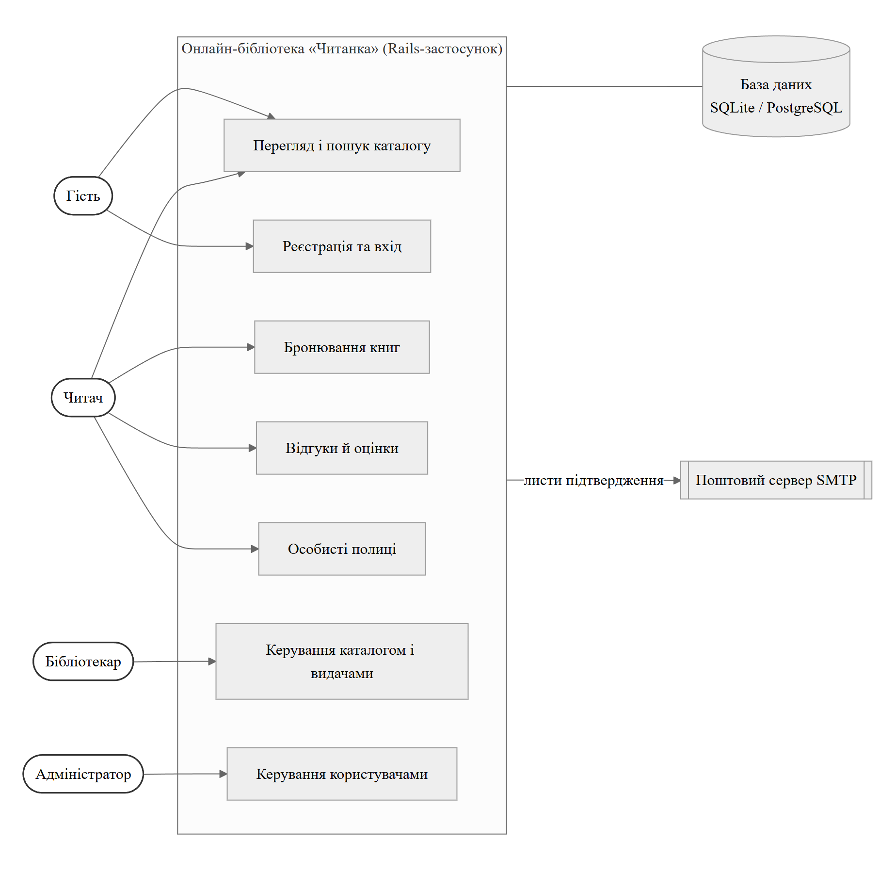
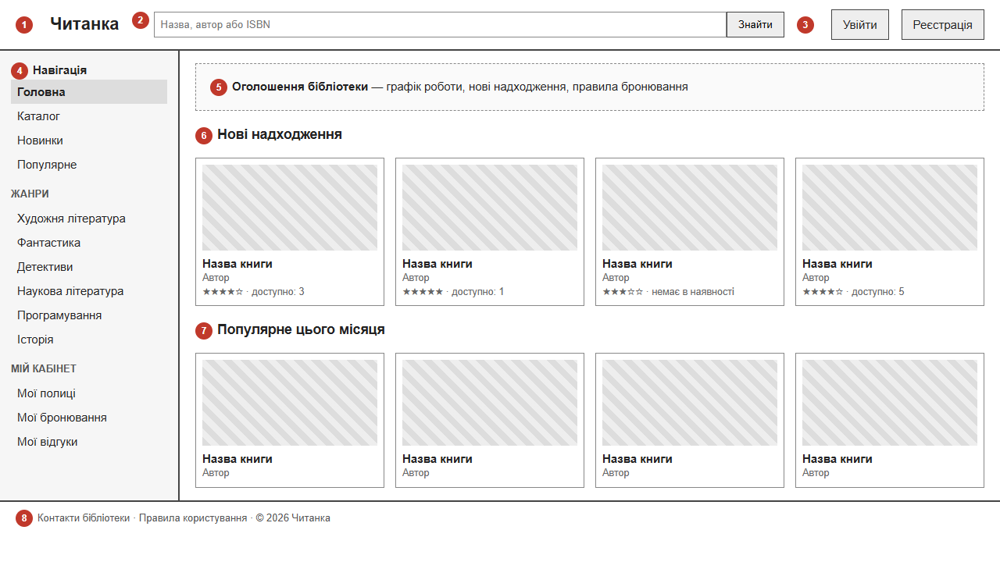
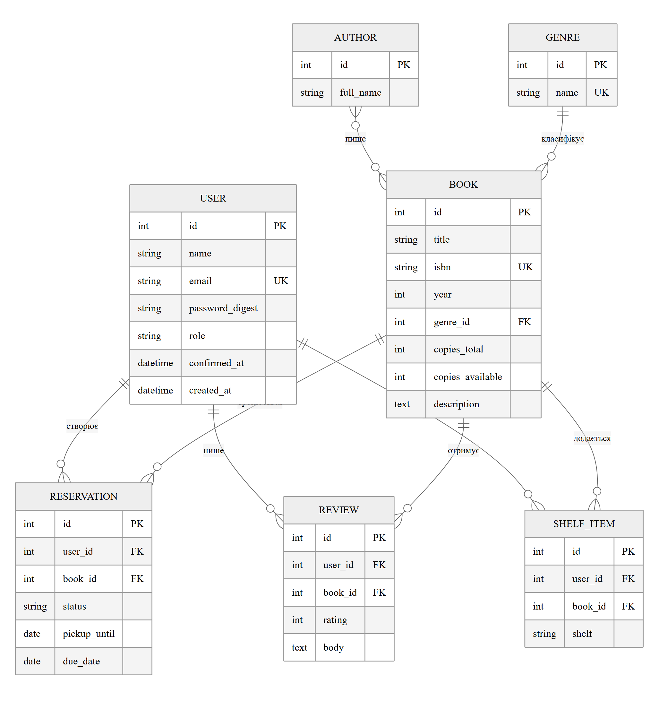

# Специфікація вимог до ПЗ «Онлайн-бібліотека „Читанка“»

Версія 1.0 (базова). Автор: Мельник В.Я., група ІП-23-2. Структура — за планом методички (шаблон К. Вігерса / IEEE 830-1998), зміст узгоджено з ISO/IEC/IEEE 29148:2018.

**Історія змін документа** наведена в таблиці 1.

*Таблиця 1 – Історія змін специфікації*

| Версія | Дата | Автор | Зміни |
|---|---|---|---|
| 1.0 | 28.09.2026 | Мельник В.Я. | Базова версія специфікації (лабораторна робота № 2) |

## 1 Вступ

### 1.1 Мета

Цей документ описує функціональні та нефункціональні вимоги до версії 1.0 веб-застосунку «Читанка» — онлайн-бібліотеки з електронним каталогом книг і бронюванням примірників. Документ призначений для розробника застосунку, викладача, який виступає замовником і рецензентом, а також для тестування готового продукту. Специфікація є базовою: вона уточнюватиметься під час виконання наступних лабораторних робіт, актуальна версія зберігається в репозиторії проєкту на GitHub.

### 1.2 Обсяг проекту

Програмний продукт — веб-застосунок «Читанка» на Ruby on Rails. Він дає змогу:

- переглядати електронний каталог фонду бібліотеки, шукати книги за назвою, автором та ISBN і бачити кількість вільних примірників;
- бронювати вільний примірник, щоб отримати його на абонементі бібліотеки;
- залишати відгуки й оцінки книгам і вести особисті полиці («Хочу прочитати», «Читаю», «Прочитано»);
- бібліотекарю — вести каталог (книги, автори, жанри), обробляти бронювання, фіксувати видачу та повернення книг;
- адміністратору — керувати обліковими записами та ролями користувачів.

Застосунок зменшує кількість звернень до бібліотеки з питанням «чи є книга в наявності» і замінює паперовий облік бронювань. Зовнішні сутності та основні функції системи показано на контекстній діаграмі (рисунок 1).

*Рисунок 1 – Контекстна діаграма онлайн-бібліотеки «Читанка»*

До версії 1.0 не входять: читання електронних копій книг онлайн, оплата штрафів, мобільний застосунок та імпорт даних із зовнішніх каталогів (наприклад, Open Library API). Ці функції можуть бути додані в наступних версіях.

### 1.3 Сфера застосування проекту

Система розрахована на невелику бібліотеку (шкільну, університетську кафедральну або районну) з фондом до 10 000 назв і до 2 000 зареєстрованих читачів. Одночасно проєкт є навчальним: на ньому відпрацьовується розробка веб-сайту за шаблоном MVC у межах дисципліни «Мови програмування для web».

### 1.4 Словник термінів

Терміни й скорочення, які використовуються в специфікації, наведено в таблиці 2.

*Таблиця 2 – Словник термінів*

| Термін | Визначення |
|---|---|
| Каталог | Перелік усіх книг бібліотеки з описом і кількістю примірників |
| Примірник | Фізична копія книги, яку можна видати читачу |
| Бронювання | Резерв вільного примірника за читачем на 3 дні до його отримання |
| Видача | Передача примірника читачу на абонементі на строк 14 днів |
| Полиця | Особистий список книг читача з позначкою статусу читання |
| Відгук | Оцінка книги від 1 до 5 з необов'язковим текстом |
| Гість | Неавторизований відвідувач сайту |
| Читач | Зареєстрований користувач з підтвердженим email |
| Бібліотекар | Працівник бібліотеки, який веде каталог і видачі |
| Адміністратор | Користувач, який керує обліковими записами і ролями |
| ISBN | Міжнародний стандартний книжковий номер (10 або 13 цифр) |
| SRS | Software Requirements Specification — специфікація вимог до ПЗ |
| MVC | Шаблон «модель — представлення — контролер», на якому побудовано Rails |

### 1.5 Посилання на документи

- Методичні вказівки до лабораторних робіт з дисципліни «Мови програмування для web».
- ISO/IEC/IEEE 29148:2018. Systems and software engineering — Life cycle processes — Requirements engineering.
- ДСТУ ISO/IEC/IEEE 29148:2025. Інженерія систем і програмних засобів. Процеси життєвого циклу. Інженерія вимог.
- Wiegers K. E. Software Requirements Specification Template.
- Ruby on Rails Guides — https://guides.rubyonrails.org.

## 2 Загальний опис

### 2.1 Класи і характеристики користувачів

#### 2.1.1 Класи користувачів

Система має чотири класи користувачів (таблиця 3). Основний (пріоритетний) клас — читачі: у разі конфлікту вимог перевага надається зручності читача.

*Таблиця 3 – Класи користувачів*

| Клас | Опис | Кількість | Пріоритет |
|---|---|---|---|
| Гість | Будь-який відвідувач сайту без облікового запису | Не обмежена | Низький |
| Читач | Зареєстрований користувач бібліотеки | До 2 000 | Основний |
| Бібліотекар | Працівник бібліотеки | 2–5 | Високий |
| Адміністратор | Відповідальний за роботу системи | 1–2 | Високий |

#### 2.1.2 Ролі користувачів

Роль зберігається в полі `role` облікового запису і може мати значення `reader`, `librarian` або `admin`; гість не має облікового запису. Можливості ролей:

- **гість** — переглядає каталог, картки книг і відгуки, реєструється та входить у систему;
- **читач** — усе, що гість, а також бронює книги, пише відгуки, веде полиці, переглядає свої бронювання та історію видач;
- **бібліотекар** — усе, що читач, а також створює і редагує картки книг, авторів і жанрів, обробляє бронювання, фіксує видачу й повернення, приховує некоректні відгуки;
- **адміністратор** — усе, що бібліотекар, а також змінює ролі та блокує облікові записи.

Детальний розподіл функцій між ролями наведено в підрозділі 3.3.

#### 2.1.3 Характеристики користувачів

Читачі — учні, студенти та дорослі відвідувачі з базовими навичками роботи в браузері; значна частина заходить зі смартфона, тому інтерфейс має бути адаптивним. Бібліотекарі мають середній рівень володіння ПК і працюють з настільного комп'ютера; для них важливі швидкі форми та пошук за ISBN. Адміністратор має технічні навички і доступ до сервера.

### 2.2 Робоче середовище

- серверна частина: Ruby 3.4, Ruby on Rails 8.1, вебсервер Puma, ОС Linux (Ubuntu 24.04; під час розробки — віртуальна машина VirtualBox з Ubuntu 24.04);
- СУБД: SQLite 3 під час розробки, PostgreSQL 16 в експлуатації;
- клієнтська частина: дві останні версії браузерів Chrome, Firefox, Edge і Safari на ПК та смартфонах із шириною екрана від 360 px;
- основні функції (пошук, бронювання, відгуки) працюють і без JavaScript; Hotwire (Turbo) лише прискорює навігацію.

### 2.3 Обмеження проєктування і реалізації

- застосунок реалізується на Ruby on Rails за шаблоном MVC відповідно до мети дисципліни;
- мова інтерфейсу — українська, тексти зберігаються у файлах локалізації `config/locales/uk.yml`;
- використовуються лише бібліотеки з вільними ліцензіями;
- вихідний код і специфікація зберігаються в Git-репозиторії на GitHub;
- розробку виконує одна особа протягом семестру, тому функції реалізуються за пріоритетами.

### 2.4 Припущення та залежності

- для надсилання листів доступний SMTP-сервер (наприклад, Gmail SMTP) з обліковими даними бібліотеки;
- початкові дані каталогу надає бібліотека (таблиця CSV або ручне введення бібліотекарем);
- усі дати й строки рахуються в часовому поясі Europe/Kyiv.

## 3 Особливості системи

### 3.1 Специфікація функціональних вимог

У цьому підрозділі кожну функцію системи описано з пріоритетом і послідовністю «дія користувача — відповідь системи». Детальні вимоги з ідентифікаторами наведено в підрозділі 3.2.

#### 3.1.1 Створення облікового запису користувача

*Опис і пріоритет.* Гість створює обліковий запис читача. Пріоритет — високий: без облікового запису недоступні бронювання, відгуки й полиці.

1. гість натискає «Реєстрація» — система показує форму з полями «Ім'я», «Email», «Пароль», «Підтвердження пароля»;
2. гість заповнює форму і надсилає її — система перевіряє дані, створює обліковий запис з роллю «Читач» і надсилає на email лист із посиланням для підтвердження;
3. користувач відкриває посилання з листа — система підтверджує email, виконує вхід і показує повідомлення «Обліковий запис активовано»;
4. якщо дані некоректні або email уже зареєстровано — форма показується повторно з поясненням біля відповідного поля.

#### 3.1.2 Вхід користувача у систему

*Опис і пріоритет.* Зареєстрований користувач входить за email і паролем. Пріоритет — високий.

1. користувач натискає «Увійти» — система показує форму входу;
2. користувач вводить email і пароль — система перевіряє їх, створює сесію і повертає користувача на сторінку, з якої він прийшов;
3. у разі помилки система показує загальне повідомлення «Невірний email або пароль»;
4. користувач, який забув пароль, запитує лист для відновлення — система надсилає посилання для встановлення нового пароля.

#### 3.1.3 Створення основних компонентів Додатку

*Опис і пріоритет.* Основні компоненти онлайн-бібліотеки — картки книг, автори та жанри. Їх створює і редагує бібліотекар. Пріоритет — високий: без каталогу система не має змісту.

1. бібліотекар відкриває «Керування каталогом» і натискає «Додати книгу» — система показує форму картки книги;
2. бібліотекар заповнює назву, авторів, жанр, рік, ISBN, опис, кількість примірників і завантажує обкладинку — система перевіряє дані та зберігає картку;
3. нова книга одразу з'являється в каталозі та в блоці «Нові надходження» головної сторінки.

#### 3.1.4 Використання додаткового функціоналу

*Опис і пріоритет.* Додатковий функціонал — пошук і фільтрація каталогу, бронювання, відгуки та особисті полиці. Пріоритет пошуку і бронювання — високий, відгуків і полиць — середній.

1. читач шукає книгу — система показує список за запитом з фільтрами і кількістю вільних примірників;
2. читач натискає «Забронювати» — система резервує примірник на 3 дні і показує дату, до якої книгу треба забрати;
3. бібліотекар видає книгу читачу — система змінює статус бронювання на «Видано» і встановлює дату повернення;
4. читач ставить оцінку, пише відгук або додає книгу на полицю — система зберігає дані і перераховує середню оцінку книги.

### 3.2 Функціональні вимоги

Вимоги мають унікальні ідентифікатори `FR-x.y`, щоб на них можна було посилатися в тестах і наступних версіях документа. Пріоритети: В — високий, С — середній, Н — низький.

#### 3.2.1 Створення облікового запису користувача

Вимоги до реєстрації наведено в таблиці 4.

*Таблиця 4 – Вимоги до реєстрації*

| ID | Вимога | Пріоритет |
|---|---|---|
| FR-1.1 | Форма реєстрації містить поля: ім'я (2–50 символів), email, пароль (8–72 символи, щонайменше одна літера і одна цифра), підтвердження пароля | В |
| FR-1.2 | Email унікальний без урахування регістру; при повторі система показує «Цей email уже зареєстровано» | В |
| FR-1.3 | Новому користувачу автоматично призначається роль «Читач» | В |
| FR-1.4 | Система надсилає лист із посиланням для підтвердження, дійсним 24 години; до підтвердження бронювання недоступне | С |
| FR-1.5 | Помилки показуються біля полів, введені дані (крім паролів) зберігаються у формі | С |

#### 3.2.2 Вхід користувача у систему

Вимоги до входу в систему наведено в таблиці 5.

*Таблиця 5 – Вимоги до входу в систему*

| ID | Вимога | Пріоритет |
|---|---|---|
| FR-2.1 | Вхід виконується за email і паролем | В |
| FR-2.2 | При невдалому вході система не уточнює, яке саме поле хибне | В |
| FR-2.3 | Після 5 невдалих спроб за 15 хвилин вхід для цього email блокується на 15 хвилин | С |
| FR-2.4 | Позначка «Запам'ятати мене» зберігає вхід на 30 днів, без неї — до закриття браузера | Н |
| FR-2.5 | Відновлення пароля — через посилання в листі, дійсне 1 годину | С |
| FR-2.6 | Кнопка «Вийти» завершує сесію на сервері | В |

#### 3.2.3 Створення основних компонентів Додатку

Вимоги до керування каталогом наведено в таблиці 6.

*Таблиця 6 – Вимоги до керування каталогом*

| ID | Вимога | Пріоритет |
|---|---|---|
| FR-3.1 | Картка книги містить: назву (обов'язково), одного або кількох авторів, жанр, рік видання, ISBN (10 або 13 цифр, унікальний), опис, обкладинку (JPEG/PNG до 2 МБ), кількість примірників (не менше 1) | В |
| FR-3.2 | Бібліотекар редагує і видаляє картки; видалення книги з активними бронюваннями або видачами заборонене | В |
| FR-3.3 | Бібліотекар веде довідники авторів і жанрів (додавання, перейменування, видалення невикористаних) | С |
| FR-3.4 | Кількість вільних примірників перераховується автоматично під час бронювання, видачі, повернення і скасування | В |
| FR-3.5 | Бібліотекар бачить список бронювань з фільтром за статусом і позначає «Видано» та «Повернено» | В |

#### 3.2.4 Використання додаткового функціоналу

Вимоги до пошуку, бронювання, відгуків, полиць і керування користувачами наведено в таблиці 7.

*Таблиця 7 – Вимоги до пошуку, бронювання, відгуків і полиць*

| ID | Вимога | Пріоритет |
|---|---|---|
| FR-4.1 | Пошук за частиною назви, автора або ISBN без урахування регістру; фільтри за жанром, роком і «лише доступні»; сортування за назвою, датою додавання, оцінкою; 20 книг на сторінку | В |
| FR-4.2 | Читач бронює книгу, лише якщо є вільний примірник; одночасно не більше 5 активних бронювань і видач | В |
| FR-4.3 | Бронювання діє 3 дні; неотримані бронювання щодня о 00:00 автоматично скасовуються, а примірник стає вільним | В |
| FR-4.4 | Строк видачі — 14 днів; за 2 дні до його завершення читач отримує лист-нагадування | С |
| FR-4.5 | Відгук містить оцінку 1–5 і текст до 2 000 символів; один відгук від читача на книгу; свій відгук можна змінити або видалити; бібліотекар може приховати відгук | С |
| FR-4.6 | Полиці «Хочу прочитати», «Читаю», «Прочитано»; книга може бути лише на одній полиці користувача | Н |
| FR-4.7 | Адміністратор змінює ролі користувачів і блокує облікові записи | С |

### 3.3 Розподіл функцій за ролями

Доступ ролей до функцій системи наведено в таблиці 8 («+» — дозволено, «–» — заборонено).

*Таблиця 8 – Матриця доступу ролей до функцій*

| Функція | Гість | Читач | Бібліотекар | Адмін. |
|---|---|---|---|---|
| Перегляд і пошук каталогу | + | + | + | + |
| Реєстрація, вхід | + | – | – | – |
| Бронювання, полиці, відгуки | – | + | + | + |
| Керування каталогом (FR-3.1–3.3) | – | – | + | + |
| Обробка бронювань і видач | – | – | + | + |
| Приховування відгуків | – | – | + | + |
| Керування користувачами | – | – | – | + |

## 4 Вимоги до зовнішнього інтерфейсу

### 4.1 Користувацький інтерфейс

Усі сторінки використовують спільний макет: верхня панель, бічна навігаційна панель, основна область і нижній колонтитул. Повідомлення про успіх або помилку показуються над основною областю, помилки форм — біля відповідних полів. Інтерфейс адаптивний: на екранах, вужчих за 768 px, бічна панель ховається в кнопку меню «☰», а сітка карток перебудовується в одну-дві колонки.

#### 4.1.1 Головна сторінка

Каркасний макет головної сторінки наведено на рисунку 2; цифрами позначено елементи:

*Рисунок 2 – Макет головної сторінки з бічною навігаційною панеллю*

- 1 — логотип «Читанка», посилання на головну сторінку;
- 2 — рядок пошуку за назвою, автором або ISBN (FR-4.1), доступний на всіх сторінках;
- 3 — кнопки «Увійти» і «Реєстрація»; після входу замість них — ім'я користувача з меню «Профіль», «Вийти»;
- 4 — бічна навігаційна панель (підрозділ 4.1.2);
- 5 — блок оголошень бібліотеки (графік роботи, правила бронювання), який редагує бібліотекар;
- 6 — «Нові надходження»: 8 останніх доданих книг;
- 7 — «Популярне цього місяця»: 8 книг з найбільшою кількістю бронювань за 30 днів;
- 8 — нижній колонтитул з контактами і правилами користування.

Картка книги в сітці показує обкладинку, назву, автора, середню оцінку і кількість вільних примірників; клік по картці відкриває сторінку книги.

#### 4.1.2 Бічна навігаційна панель

- розділ «Навігація»: «Головна», «Каталог», «Новинки», «Популярне»; поточний пункт виділено;
- розділ «Жанри»: перелік жанрів з довідника, клік відкриває каталог із фільтром за жанром;
- розділ «Мій кабінет» («Мої полиці», «Мої бронювання», «Мої відгуки») показується лише авторизованим користувачам;
- для бібліотекаря додається розділ «Бібліотека»: «Керування каталогом», «Бронювання і видачі»;
- для адміністратора додається пункт «Користувачі».

### 4.2 Програмні та комунікаційні інтерфейси

- взаємодія браузера з сервером — HTTP/1.1 і HTTPS (TLS 1.2 і новіше) в експлуатації; сторінки — HTML5, обмін формами — стандартні POST-запити з CSRF-токеном;
- доступ до бази даних — через ORM Active Record; схема змінюється лише міграціями Rails;
- надсилання листів — Action Mailer через SMTP (порт 587, STARTTLS);
- зберігання обкладинок — Active Storage на локальному диску сервера;
- зовнішніх API у версії 1.0 немає.

## 5 Нефункціональні вимоги

### 5.1 Структура даних користувачів

Логічну модель даних наведено на рисунку 3. Користувач пов'язаний з бронюваннями, відгуками та елементами полиць зв'язками «один до багатьох», книга з авторами — «багато до багатьох».

*Рисунок 3 – Логічна модель даних (ER-діаграма)*

Поля таблиці користувачів `users` та обмеження на них наведено в таблиці 9.

*Таблиця 9 – Структура таблиці users*

| Поле | Тип | Обмеження | Опис |
|---|---|---|---|
| id | integer | PK | Ідентифікатор |
| name | string(50) | NOT NULL, 2–50 символів | Ім'я для відображення |
| email | string(255) | NOT NULL, UNIQUE, формат email | Логін і адреса для листів |
| password_digest | string | NOT NULL | Хеш пароля bcrypt |
| role | string | reader / librarian / admin | Роль, типово reader |
| confirmed_at | datetime | NULL до підтвердження | Дата підтвердження email |
| blocked | boolean | типово false | Ознака блокування |
| created_at, updated_at | datetime | NOT NULL | Службові дати Rails |

### 5.2 Вимоги безпеки

- паролі зберігаються лише як хеш bcrypt (`has_secure_password`); паролі та токени не записуються в журнали (`filter_parameters`);
- в експлуатації увесь трафік іде через HTTPS (`config.force_ssl = true`);
- усі форми захищені CSRF-токеном, вивід у шаблонах ERB екранується (захист від XSS), запити до БД виконуються лише через Active Record з параметрами (захист від SQL-ін'єкцій);
- права доступу перевіряються на сервері для кожної дії контролера згідно з таблицею 8, а не лише приховуванням кнопок в інтерфейсі;
- cookie сесії мають атрибути HttpOnly, Secure і SameSite=Lax;
- email користувачів не показується іншим користувачам; читач може видалити свій обліковий запис (вимога Закону України «Про захист персональних даних»).

### 5.3 Продуктивність і надійність

- 95 % сторінок формуються сервером менш ніж за 1 с при 50 одночасних користувачах;
- пошук у каталозі з 10 000 книг виконується менш ніж за 2 с;
- доступність системи — не менше 99 % у робочі години бібліотеки;
- база даних щоденно резервно копіюється, копії зберігаються 14 днів;
- моделі й контролери покриваються автоматичними тестами Minitest (не менше 70 % рядків коду); кожна вимога FR-x.y перевіряється щонайменше одним тестом.
